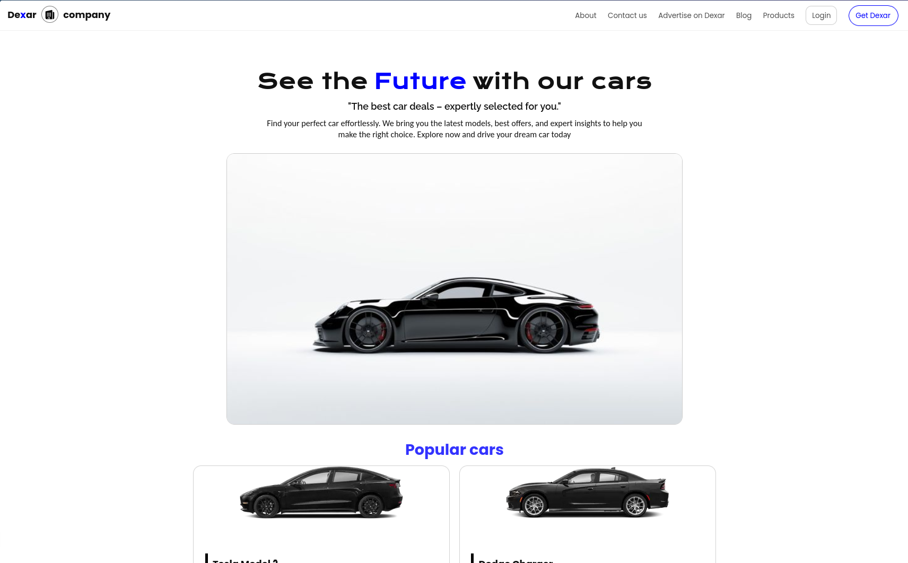

# Dexar - Car Company Landing Page

  

A static landing page for "Dexar," a conceptual car sales company. This project was my first complete website built in **December 2024** after learning the fundamentals of HTML and CSS, with a focus on a desktop-first design.

The page features a modern design, a product showcase, and a separate login page template.

---

### Live Demo

> You can view the live version of the project **[here](https://4jib0x.github.io/Dexar_landing-page/ )**.

---

### ✨ Features

-   **Desktop-First Design:** A clean layout optimized for desktop and large screens.
-   **Component-Based Structure:** Includes a navigation bar, hero section, popular cars grid, and footer.
-   **Static Pages:** Contains `index.html` for the main page and a separate `login.html`.
-   **Pure CSS:** All styling is done with custom CSS, focusing on fundamentals like Flexbox and Grid.

---

### 🛠️ Technologies Used

-   **HTML5:** For the structure and content.
-   **CSS3:** For styling and layout.

---

### 🚀 How to View

1.  **Live Demo:** The easiest way is to visit the **Live Demo** link above (best viewed on a desktop).
2.  **Locally:**
    -   Clone the repository: `git clone https://github.com/abdou-agiba/Dexar_landing_page.git`
    -   Open the `index.html` file in your web browser.
